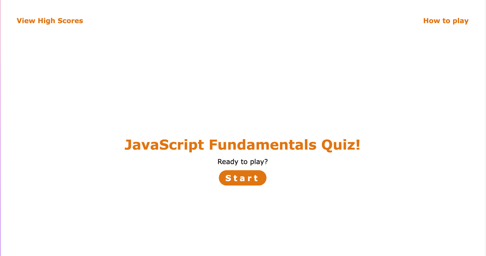
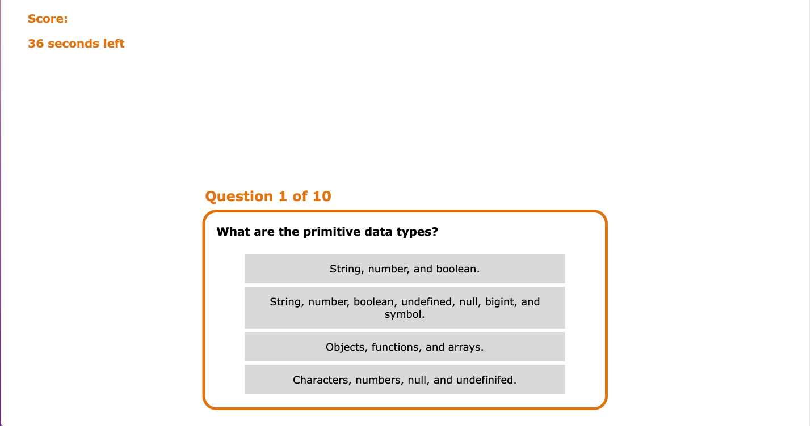

# JS-Quiz

## Description

I created this quiz to review javascript fundamentals. It is a great resource for those learning javaScript for the first time to review what they have learned and track their progress through score improvements. While I was making a quiz about javascript fundamentals, I was learning how to use jQuery to streamline vanilla JS. I learned about interaction with the window location and local storage.

## Installation

To use this study tool, follow the link or copy and paste it into your browser: https://isabellakingson.github.io/JS-Quiz/.

## Usage

Begin by clicking 'How to play.' After reading the instructions, click 'How to play' again to return to the starting page. Click the start button and answer as many questions correctly as you can. Then enter your initials and hit submit to save your score. This is a great tool for reviewing your javaScript fundamentals.

## Credits

I used these tutorials to help be figure out how to create a quiz site with javaScrips: https://www.geeksforgeeks.org/how-to-create-a-simple-javascript-quiz/amp/, https://www.youtube.com/watch?v=PBcqGxrr9g8.
I also had a lot of help from my tutor Alistair Rowden with navigating jQuery, adding event listeners, and debugging.